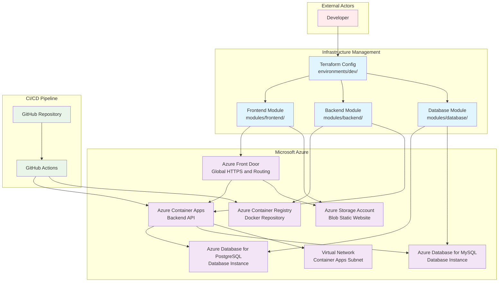
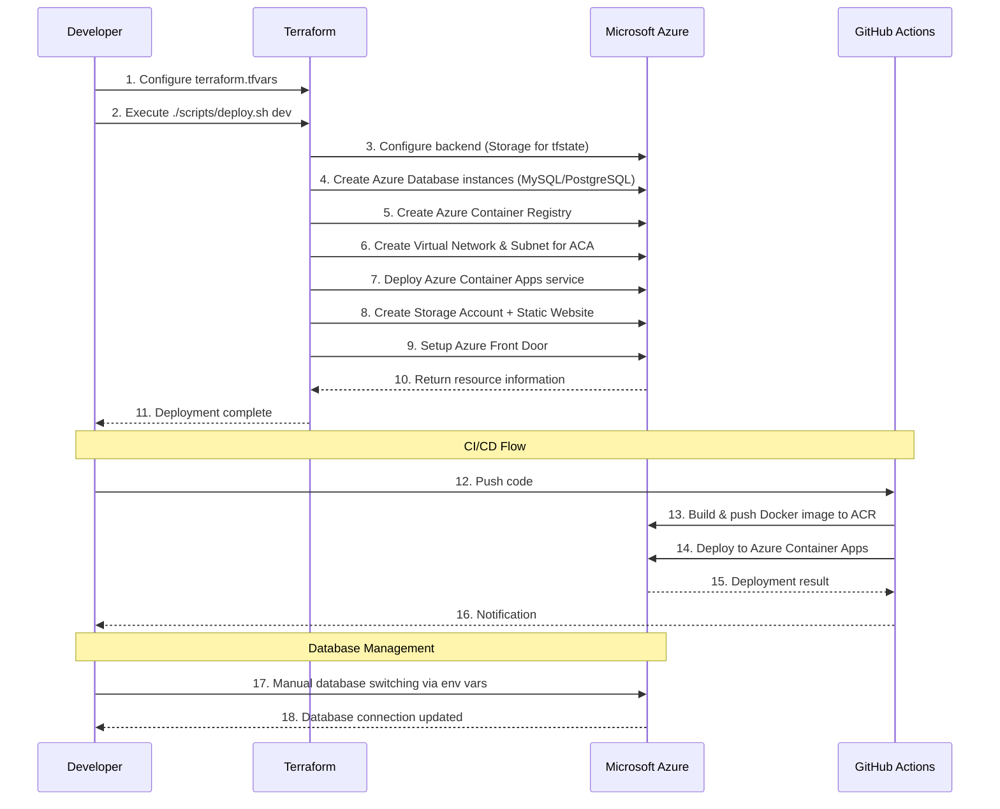

# ToDo Infrastructure on Azure - Architecture Diagram

## System Architecture

```mermaid
graph TB
    subgraph "External Actors"
        DEV[Developer]
    end

    subgraph "Infrastructure Management"
        DEV_TERRAFORM[Terraform Config<br/>environments/dev/]
        DB_MODULE[Database Module<br/>modules/database/]
        BACKEND_MODULE[Backend Module<br/>modules/backend/]
        FRONTEND_MODULE[Frontend Module<br/>modules/frontend/]
    end

    subgraph "Microsoft Azure"
        ACA[Azure Container Apps<br/>Backend API]
        MYSQL[Azure Database for MySQL<br/>Database Instance]
        POSTGRESQL[Azure Database for PostgreSQL<br/>Database Instance]
        ACR[Azure Container Registry<br/>Docker Repository]
        STORAGE[Azure Storage Account<br/>Blob Static Website]
        FRONT_DOOR[Azure Front Door<br/>Global HTTPS and Routing]
        VNET[Virtual Network<br/>Container Apps Subnet]
    end

    subgraph "CI/CD Pipeline"
        GITHUB[GitHub Repository]
        GITHUB_ACTIONS[GitHub Actions]
    end

    %% Development Flow
    DEV --> DEV_TERRAFORM
    DEV_TERRAFORM --> DB_MODULE
    DEV_TERRAFORM --> BACKEND_MODULE
    DEV_TERRAFORM --> FRONTEND_MODULE

    %% Infrastructure Resources
    DB_MODULE --> MYSQL
    DB_MODULE --> POSTGRESQL
    BACKEND_MODULE --> ACA
    BACKEND_MODULE --> ACR
    FRONTEND_MODULE --> STORAGE
    FRONTEND_MODULE --> FRONT_DOOR
    ACA --> VNET

    %% Service Connections
    ACA --> MYSQL
    ACA --> POSTGRESQL
    FRONT_DOOR --> STORAGE
    FRONT_DOOR --> ACA

    %% CI/CD
    GITHUB --> GITHUB_ACTIONS
    GITHUB_ACTIONS --> ACR
    GITHUB_ACTIONS --> ACA

    %% Styles
    classDef actorClass fill:#ffebee
    classDef infraClass fill:#e1f5fe
    classDef azureClass fill:#f3e5f5
    classDef cicdClass fill:#e8f5e8

    class DEV actorClass
    class DEV_TERRAFORM,DB_MODULE,BACKEND_MODULE,FRONTEND_MODULE infraClass
    class ACA,MYSQL,POSTGRESQL,ACR,STORAGE,FRONT_DOOR,VNET, azureClass
    class GITHUB,GITHUB_ACTIONS cicdClass
```

## Deployment Flow

```mermaid
sequenceDiagram
    participant Dev as Developer
    participant Terraform as Terraform
    participant Azure as Microsoft Azure
    participant GitHub as GitHub Actions

    Dev->>Terraform: 1. Configure terraform.tfvars
    Dev->>Terraform: 2. Execute ./scripts/deploy.sh dev
    Terraform->>Azure: 3. Configure backend (Storage for tfstate)
    Terraform->>Azure: 4. Create Azure Database instances (MySQL/PostgreSQL)
    Terraform->>Azure: 5. Create Azure Container Registry
    Terraform->>Azure: 6. Create Virtual Network & Subnet for ACA
    Terraform->>Azure: 7. Deploy Azure Container Apps service
    Terraform->>Azure: 8. Create Storage Account + Static Website
    Terraform->>Azure: 9. Setup Azure Front Door
    Azure-->>Terraform: 10. Return resource information
    Terraform-->>Dev: 11. Deployment complete

    Note over Dev,GitHub: CI/CD Flow
    Dev->>GitHub: 12. Push code
    GitHub->>Azure: 13. Build & push Docker image to ACR
    GitHub->>Azure: 14. Deploy to Azure Container Apps
    Azure-->>GitHub: 15. Deployment result
    GitHub-->>Dev: 16. Notification

    Note over Dev,Azure: Database Management
    Dev->>Azure: 17. Manual database switching via env vars
    Azure-->>Dev: 18. Database connection updated
```
