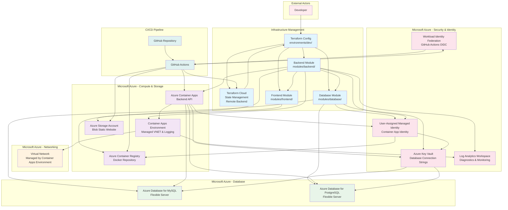
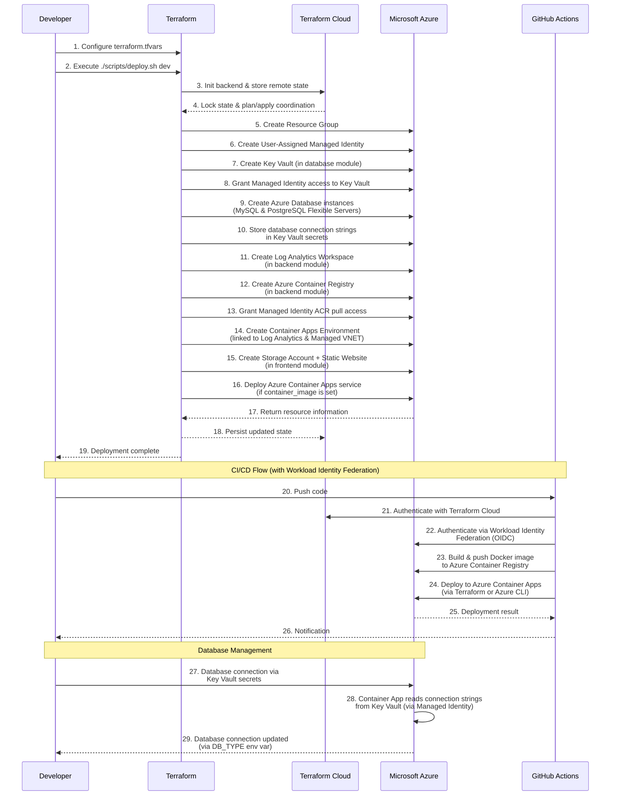

# ToDo Infrastructure on Microsoft Azure - Architecture Diagram

## System Architecture

```mermaid
graph TB
    subgraph "External Actors"
        DEV[Developer]
    end

    subgraph "Infrastructure Management"
        DEV_TERRAFORM[Terraform Config<br/>environments/dev/]
        TF_CLOUD[Terraform Cloud<br/>State Management<br/>Remote Backend]
        DB_MODULE[Database Module<br/>modules/database/]
        BACKEND_MODULE[Backend Module<br/>modules/backend/]
        FRONTEND_MODULE[Frontend Module<br/>modules/frontend/]
    end

    subgraph "Microsoft Azure - Compute & Storage"
        ACA[Azure Container Apps<br/>Backend API]
        ACA_ENV[Container Apps Environment<br/>Managed VNET & Logging]
        ACR[Azure Container Registry<br/>Docker Repository]
        STORAGE[Azure Storage Account<br/>Blob Static Website]
    end

    subgraph "Microsoft Azure - Networking"
        VNET[Virtual Network<br/>Managed by Container Apps Environment]
    end

    subgraph "Microsoft Azure - Database"
        MYSQL[Azure Database for MySQL<br/>Flexible Server]
        POSTGRESQL[Azure Database for PostgreSQL<br/>Flexible Server]
    end

    subgraph "Microsoft Azure - Security & Identity"
        KEY_VAULT[Azure Key Vault<br/>Database Connection Strings]
        LAW[Log Analytics Workspace<br/>Diagnostics & Monitoring]
        MI[User-Assigned Managed Identity<br/>Container App Identity]
        OIDC[Workload Identity Federation<br/>GitHub Actions OIDC]
    end

    subgraph "CI/CD Pipeline"
        GITHUB[GitHub Repository]
        GITHUB_ACTIONS[GitHub Actions]
    end

    %% Development Flow
    DEV --> DEV_TERRAFORM
    DEV_TERRAFORM --> TF_CLOUD
    TF_CLOUD --> DEV_TERRAFORM
    DEV_TERRAFORM --> DB_MODULE
    DEV_TERRAFORM --> BACKEND_MODULE
    DEV_TERRAFORM --> FRONTEND_MODULE

    %% Infrastructure Resources
    DB_MODULE --> MYSQL
    DB_MODULE --> POSTGRESQL
    DB_MODULE --> KEY_VAULT
    DB_MODULE --> MI
    BACKEND_MODULE --> ACA
    BACKEND_MODULE --> ACA_ENV
    BACKEND_MODULE --> ACR
    BACKEND_MODULE --> LAW
    BACKEND_MODULE --> MI
    BACKEND_MODULE --> DB_MODULE
    BACKEND_MODULE --> FRONTEND_MODULE
    FRONTEND_MODULE --> STORAGE
    ACA --> ACA_ENV
    ACA --> MI

    %% Networking Flow
    ACA_ENV --> VNET
    ACA_ENV --> LAW

    %% Service Connections
    ACA --> MYSQL
    ACA --> POSTGRESQL
    ACA --> KEY_VAULT
    MI --> KEY_VAULT
    MI --> ACR
    KEY_VAULT --> MYSQL
    KEY_VAULT --> POSTGRESQL

    %% CI/CD
    GITHUB --> GITHUB_ACTIONS
    GITHUB_ACTIONS --> TF_CLOUD
    GITHUB_ACTIONS --> OIDC
    OIDC --> GITHUB_ACTIONS
    GITHUB_ACTIONS --> ACR
    GITHUB_ACTIONS --> ACA
    GITHUB_ACTIONS --> STORAGE

    %% Styles
    classDef actorClass fill:#ffebee
    classDef infraClass fill:#e1f5fe
    classDef computeClass fill:#f3e5f5
    classDef networkClass fill:#fff3e0
    classDef dbClass fill:#e8f5e9
    classDef securityClass fill:#fce4ec
    classDef cicdClass fill:#e0f2f1

    class DEV actorClass
    class DEV_TERRAFORM,TF_CLOUD,DB_MODULE,BACKEND_MODULE,FRONTEND_MODULE infraClass
    class ACA,ACA_ENV,ACR,STORAGE computeClass
    class VNET networkClass
    class MYSQL,POSTGRESQL dbClass
    class KEY_VAULT,LAW,MI,OIDC securityClass
    class GITHUB,GITHUB_ACTIONS cicdClass
```

## Deployment Flow

```mermaid
sequenceDiagram
    participant Dev as Developer
    participant Terraform as Terraform
    participant TFCloud as Terraform Cloud
    participant Azure as Microsoft Azure
    participant GitHub as GitHub Actions

    Dev->>Terraform: 1. Configure terraform.tfvars
    Dev->>Terraform: 2. Execute ./scripts/deploy.sh dev
    Terraform->>TFCloud: 3. Init backend & store remote state
    TFCloud-->>Terraform: 4. Lock state & plan/apply coordination
    Terraform->>Azure: 5. Create Resource Group
    Terraform->>Azure: 6. Create User-Assigned Managed Identity
    Terraform->>Azure: 7. Create Key Vault (in database module)
    Terraform->>Azure: 8. Grant Managed Identity access to Key Vault
    Terraform->>Azure: 9. Create Azure Database instances<br/>(MySQL & PostgreSQL Flexible Servers)
    Terraform->>Azure: 10. Store database connection strings<br/>in Key Vault secrets
    Terraform->>Azure: 11. Create Log Analytics Workspace<br/>(in backend module)
    Terraform->>Azure: 12. Create Azure Container Registry<br/>(in backend module)
    Terraform->>Azure: 13. Grant Managed Identity ACR pull access
    Terraform->>Azure: 14. Create Container Apps Environment<br/>(linked to Log Analytics & Managed VNET)
    Terraform->>Azure: 15. Create Storage Account + Static Website<br/>(in frontend module)
    Terraform->>Azure: 16. Deploy Azure Container Apps service<br/>(if container_image is set)
    Azure-->>Terraform: 17. Return resource information
    Terraform-->>TFCloud: 18. Persist updated state
    Terraform-->>Dev: 19. Deployment complete

    Note over Dev,GitHub: CI/CD Flow (with Workload Identity Federation)
    Dev->>GitHub: 20. Push code
    GitHub->>TFCloud: 21. Authenticate with Terraform Cloud
    GitHub->>Azure: 22. Authenticate via Workload Identity<br/>Federation (OIDC)
    GitHub->>Azure: 23. Build & push Docker image<br/>to Azure Container Registry
    GitHub->>Azure: 24. Deploy to Azure Container Apps<br/>(via Terraform or Azure CLI)
    Azure-->>GitHub: 25. Deployment result
    GitHub-->>Dev: 26. Notification

    Note over Dev,Azure: Database Management
    Dev->>Azure: 27. Database connection via<br/>Key Vault secrets
    Azure->>Azure: 28. Container App reads connection strings<br/>from Key Vault (via Managed Identity)
    Azure-->>Dev: 29. Database connection updated<br/>(via DB_TYPE env var)
```
